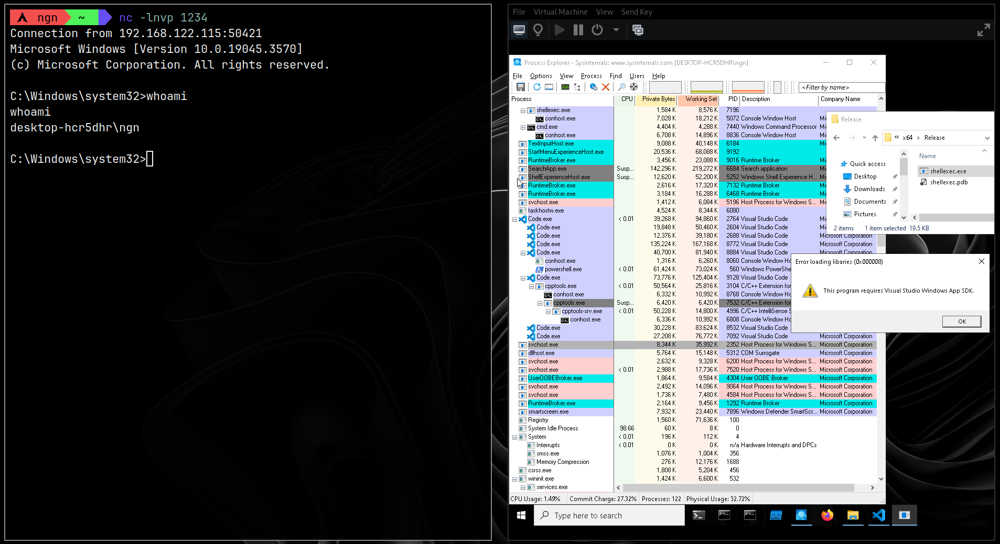

<h1 align="center">
    
  <br>
  <br>
  shellexec | shellcode launcher  
</h1>

Just a little shellcode launcher that I put together, written in C(++)

## Protections 
- Shellcode encryption with XOR
- Fake error box to trick the user
- Process check (Checks for blacklisted processes)
- Debug check (`PEB->IsBeingDebugged`) 
- VM check (CPUID)

## Configuration
The default configuration file can be found at [`config.json.default`](config.json.default).
After getting your raw shellcode and the configuration file ready, run the `config.py` script to 
generate the `src/config.cpp` file:
```bash	
python3 config.py <shellcode file> <configuration file> 
```

## Building
After running the `config.py` script, you can run the `build32.bat` script for a 32 bit build, 
or the `build64.bat` script for a 64 bit build. **You will need to run these in a VS command prompt,
otherwise devenv won't be accessible**.

## How does it work?
1. Runs enabled protections, if protection checks fail then the program stops execution
2. XORed shellcode gets decrypted
3. Program loops over the process list and tries to find a target process 
4. Writes the shellcode to target process' memory with `VirtualAllocEx` and `WriteProcessMemory`
5. Creates a thread for the process using `CreateRemoteThread` which just sleeps
6. Hijacks the new thread's execution using `SuspendThread` and `SetThreadContext`
7. If fails looks for an another process (aka goes back to step 3)
8. Lastly, program creates a fake error box if the config to do so is enabled 

## Resources
- [Generating shellcode with metasploit](https://docs.metasploit.com/docs/using-metasploit/basics/how-to-use-msfvenom.html)
- [TIB](https://wikiless.org/wiki/Win32_Thread_Information_Block?lang=en)
- [CPUID](https://wikiless.org/wiki/CPUID?lang=en)
- [Thread hijacking](https://www.ired.team/offensive-security/code-injection-process-injection/injecting-to-remote-process-via-thread-hijacking)
- [CreateRemoteThread shellcode injection](https://www.ired.team/offensive-security/code-injection-process-injection/process-injection)
